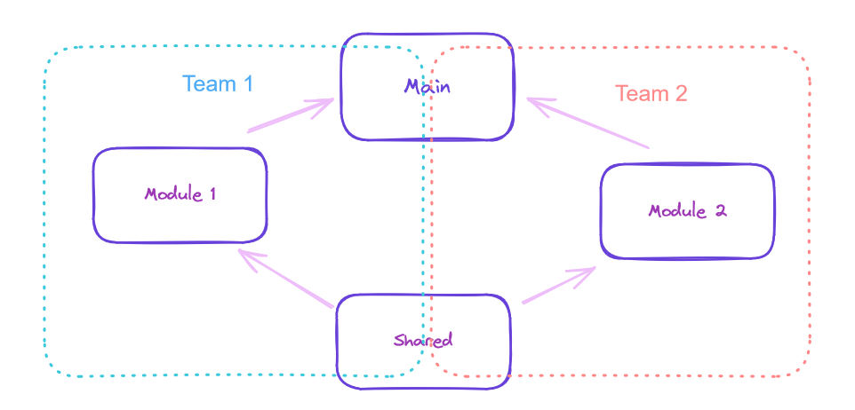

# Description
This is a Micro-frontend application where every folder at the root level is an independant repo.


## Details
The "share" repo contains common components and utilities across "mod-x" repos.

The "mod-1" repo build pages reusing components from the "share" repo and creating its own.

The "mod-2" repo build pages reusing components from the "share" repo and creating its own.

The "main" repo routes pages created in "mod-1" and "mod-2", and creates APIs for every module.

*Note: Every repo in this demo uses React but the "main" repo is the only one that also uses Nextjs for API creation.*


# Team Responsabilities
It's expected that teams invest most of their efforts on its corresponding modules and touch "share" and "main" repos as less as possible.




# Usage
Go to every subdirectory, install their dependencies and run dev mode, for example:

```sh
cd main && pnpm install
```
```sh
pnpm dev
```

Then open the application in your browser: [app](http://localhost:3000)

